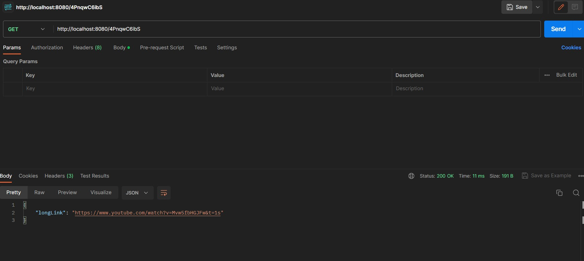

<h2>Links-Reduction-Api</h2>

<h4>Для запуска сервиса клонируйте репозиторий и выполните команду:</h4>
<code>make compose</code>

<h4>Для выбора хранилища в файле docker-compose.yml мжно изменить переменную STORE :</h4>

<code>STORE="POSTGRES"/"IN-MEMORY"</code>

<h2>REST:</h2>

<h3><code>POST</code></h3>

<code>http://localhost:8080/ </code> 

<h3><code>GET</code></h3>

<code>http://localhost:8080/ </code>

<h2>Grpc</h2>

<code>localhost:5500</code>

<h3><code>CreateShortUrl</code></h3>

<h3><code>GetLongUrl</code></h3>

<h3>Для тестов используйте команду:</h3>
<code>make test</code>